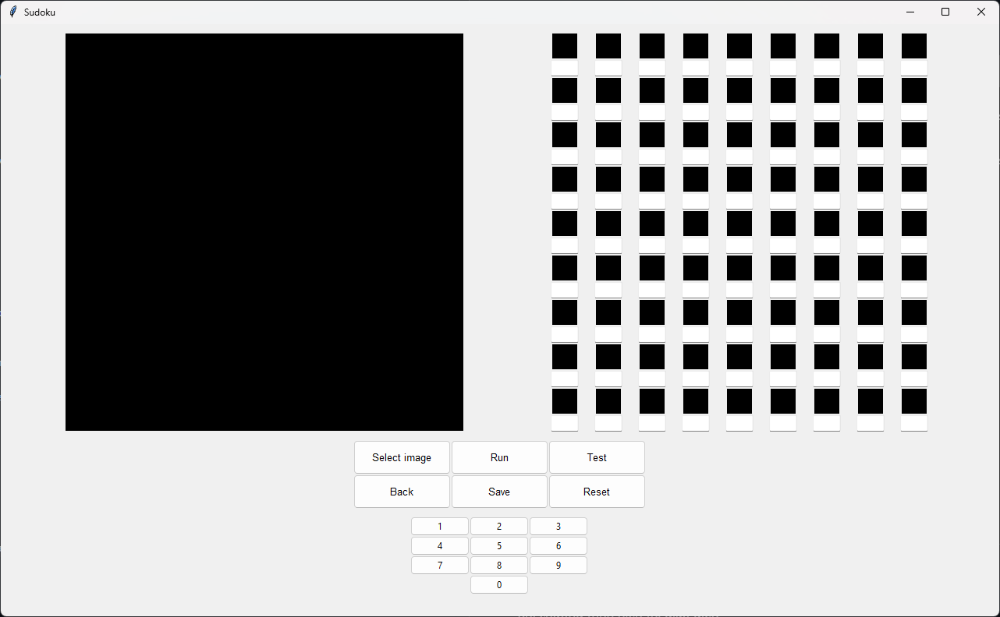
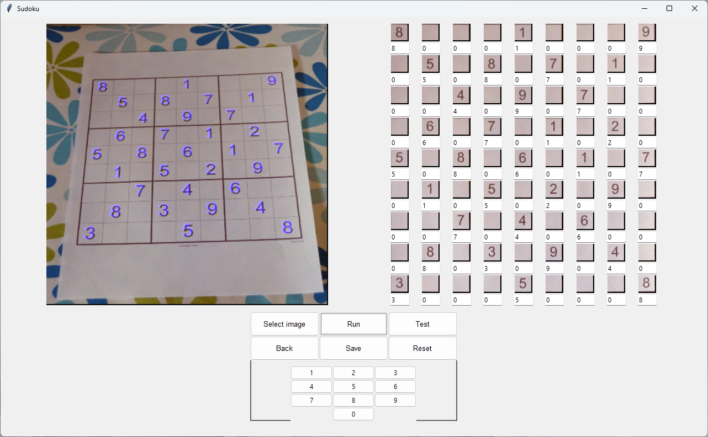
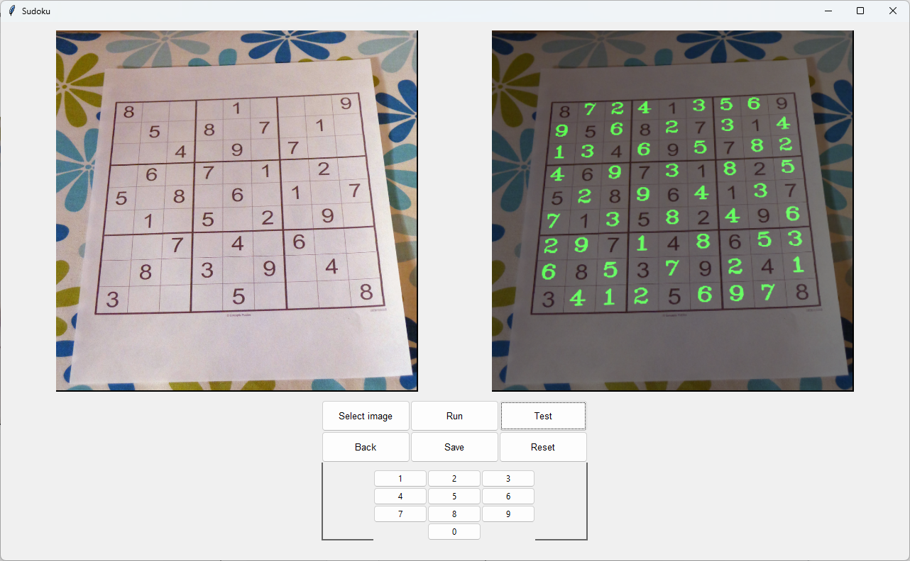

# solve-sudoku-computer-vision
solve sudoku puzzles with computer vision
## Introduction 

## Installation

### Requirements:
- Python >= 3.7
- Pytorch 

### Clone repo
```bash
    # clone repo
    git clone https://github.com/HoVDuc/solve-sudoku-computer-vision.git
    cd solve-sudoku-computer-vision
```

### Tạo môi trường
```bash
    # Tạo môi trường với conda
    conda create -n sudoku_env
    conda activate sudoku_env
```

### Cài đặt các gói
```bash
    # Cài đặt các gói thư viện cần thiết
    python -m pip install -r requirements.txt
```
Cài đặt torch và torchvision CPU
```bash
    #CPU
    pip3 install torch torchvision --index-url https://download.pytorch.org/whl/cpu
```
hoặc CUDA
```bash
    #CUDA
    pip3 install torch torchvision --index-url https://download.pytorch.org/whl/cu116
```

## Run

### Download trained model 
Tải trained mode rồi lưu vào trong thư mục `solve-sudoku-computer-vision/weights/`
```bash 
    # Download trained model
    gdown 1-Nx4iIv2RBlQ6uEhTo-jLHPg9XPer6w3
```

Nếu khi tải bị Permission denied thì chạy câu lệnh sau rồi chạy lại câu lệnh trên
```bash
    pip install -U --no-cache-dir gdown --pre
```

### Chạy chương trình
```bash
    # Run file program.py
    python program.py
```

Giao diện chương trình



Chức năng bao gồm:
- Select image: Chọn ảnh
- Run: Trích xuất câu đố
- Test: Giải câu đố
- Back: Quay trở lại giao diện trước
- Save: Lưu lại ảnh đã được giải
- Reset: Reset lại chương trình

### Demo
Từ giao diện chính chọn ```Select image``` sau đó chọn ```Run```



Nếu khi ```Run``` câu đố có bị sai có thể sửa lại bằng cách chọn vào ô có số bị sai và sửa lại số. Và nhấn ```Test```



Lưu lại ảnh và Kết thúc chương trình.

## Train model